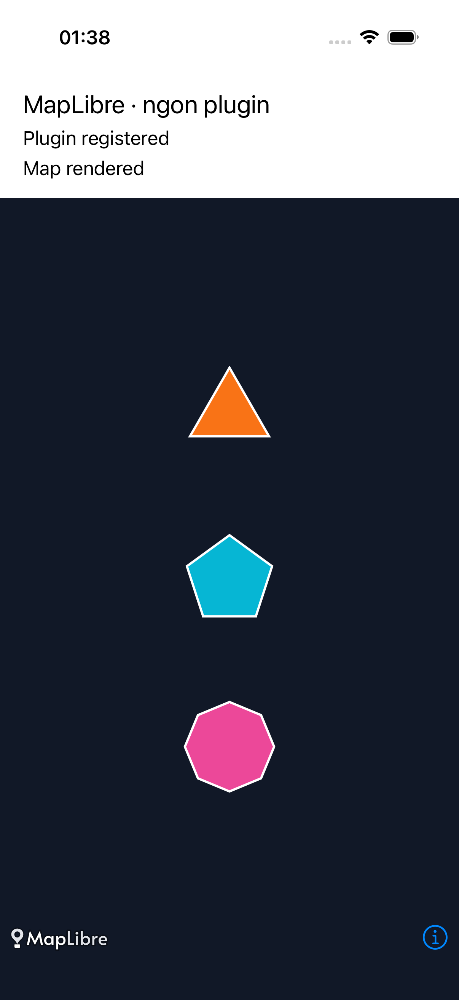

# MapLibre Native iOS plugin example

A small UIKit app that builds the copied ngon C++ plugin and registers it with
the public C API of the plugin-enabled MapLibre iOS SDK.
The bundled style is copied from the native plugin example app at
`plugins/android/app/src/main/assets/ngon.json` in `maplibre/maplibre-native`
(commit `043df51b2dfebfd8a1f0b20d355ab23238ae31bb`). It draws a grid of 24 polygons
on a light background, demonstrating corners, strokes, opacity, blur, size,
and rotation. Running the app needs no network connection or API key.



## Swift package dependency

The app uses the [`louwers/maplibre-ios-with-plugin-api`](https://github.com/louwers/maplibre-ios-with-plugin-api)
Swift package, pinned to the prerelease **`7.0.0-pre1`**. `Package.resolved` records its source revision.
It links two products:

- `MapLibre`: the plugin-enabled XCFramework. It is a drop-in replacement for the standard SDK, so
  the app uses `#import <MapLibre/MapLibre.h>` as usual.
- `MapLibrePluginApi`: the header-only C API, which lets the unchanged plugin source include
  `<mln/plugin/plugin_api.h>`.

Xcode downloads and embeds the published XCFramework through Swift Package
Manager. Building requires Xcode on macOS and an internet connection for the
initial package download. No native SDK checkout or Bazel build is required.

## Run the app

Open `NgonExample.xcodeproj`, select the `NgonExample` scheme and an iOS simulator,
wait for package resolution, then Run. For a device, choose your development
team in Signing & Capabilities.
The map fills the screen with the polygon grid. Registration and loading errors
are reported in the Xcode console.

The Xcode project compiles `Ngon/shared/cpp/ngon_layer.cpp` directly into the app
and links the `MapLibre` and `MapLibrePluginApi` package products. `App/main.mm` calls
`mln_ngon_layer_register(&mln_plugin_register_v1, ...)` before creating a map.
No MapLibre core source or private headers are used to build the app.

## Verify end to end

```sh
xcrun simctl list devices available
./scripts/test.sh SIMULATOR_UDID
```

The UI test waits for visible pixels from all eight polygon colors, verifying
plugin registration and rendering without status labels in the interface.
It retains a screenshot in `build/*.xcresult`.
The test fails if registration succeeds but the custom layer does not draw.

## Copied plugin source

`Ngon/shared/cpp/ngon_layer.cpp`, `Ngon/shared/include/ngon_layer.hpp`, and
`Ngon/scripts/generate-shaders.mjs` are unchanged copies from
`maplibre/maplibre-native` at commit
`307f59b8883c52f270b9039d61ee1a33bf7d339f`, under `plugins/ngon-layer/`.
The generated shader header is checked in so building the app needs only Xcode.
Regenerate it after changing the shader generator:

```sh
node Ngon/scripts/generate-shaders.mjs --output Ngon/generated/ngon_shader_sources.hpp
```

The Xcode project is checked in. To regenerate it, install the `xcodeproj` Ruby
gem and run `ruby scripts/generate-project.rb`. Set `MAPLIBRE_IOS_PACKAGE_PATH` to a
local checkout of the package to test an unreleased XCFramework; regenerate without it before committing.

## Validation status

Verified with Xcode 27.0 (27A266a), the iOS 27.0 SDK, and an iPhone 17 Pro
simulator running iOS 26.4:

- Resolved the published `MapLibre` and `MapLibrePluginApi` products at
  [`7.0.0-pre1`](https://github.com/louwers/maplibre-ios-with-plugin-api/releases/tag/7.0.0-pre1)
  through Swift Package Manager using a fresh build directory.
- Passed `testPluginRendersNativeExampleStyle`: visible pixels from all eight
  polygon colors using the native example style.

The SDK also wraps runtime plugin layers for the Objective-C style interface,
so accessibility can enumerate the map's layers without a nil-layer exception.
